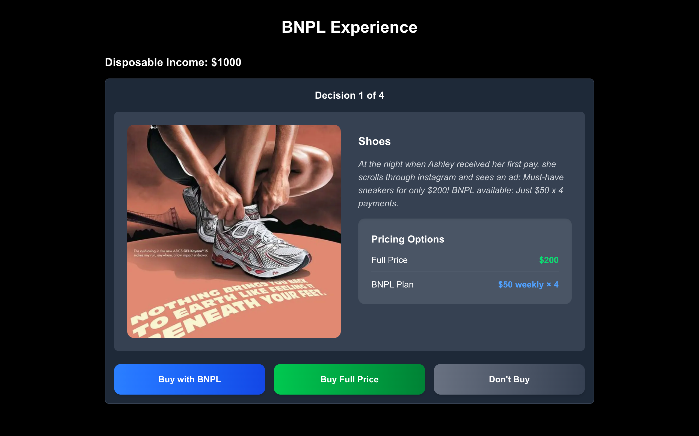

# BNPL Digital Experience

This is an interactive, browser-based **Buy Now Pay Later (BNPL)** simulation designed as part of the *Geographies of Finance and Money* module. It explores the emotional, financial, and behavioral impact of BNPL decisions through a gamified digital experience.

## Live Demo

**Deployed Site:** [BNPL Experience](https://bnpl-experience.vercel.app/)

## Project Overview
Users navigate a series of relatable purchase scenarios where they must choose whether to:
- Buy the product outright
- Use BNPL
- Skip the purchase

The visual interface dynamically responds to user decisions, updating weekly payment breakdowns, happiness scores, remaining balances, and BNPL debt. The final summary provides a reflection on financial well-being and emotional impact.

## Technologies Used
- **Next.js (React)** for building the interface
- **TypeScript** for strong type safety
- **Tailwind CSS** for styling
- **React State Hooks** for interactive decision tracking
- **Image component from Next.js** for performance-optimized media

## Features
- 4 narrative scenarios with unique images and descriptions
- Multiple purchase options: BNPL, full price, or skip
- Real-time tracking of:
  - Weekly payments
  - Remaining disposable income
  - Cumulative BNPL debt
  - Weekly balance changes
  - Happiness score
- Final summary for reflection
- Ability to restart and explore different decision paths

## Getting Started
To run the app locally:

```bash
git clone https://github.com/taylordos/bnpl-digital-experience.git
cd bnpl-experience
npm install
npm run dev
```

Then visit `http://localhost:3000` in your browser.

## Learning Goals
This project was created to:
- Explore the real-world financial impact of BNPL usage
- Reflect on consumer psychology and happiness vs. debt
- Understand how digital finance shapes everyday decision-making
- Practice turning abstract financial concepts into tangible user experiences

## Academic Context
Prepared for the **Geographies of Finance and Money** module as part of a broader exploration of how digital finance tools affect personal finance, consumer habits, and emotional well-being.
